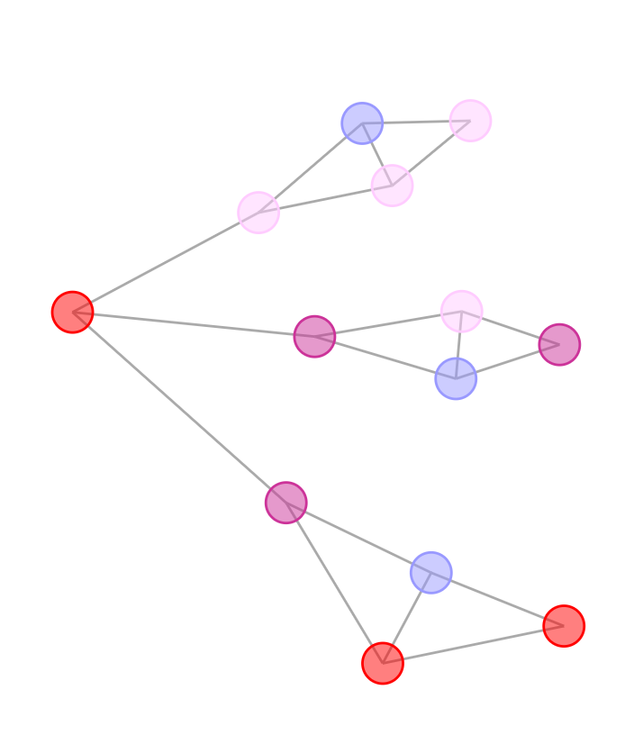

# D3_Test
Try the node link diagram yourself at https://drophy.github.io/D3_Test/!

## Description
This is an example created by Mike Bostock on how to prevent D3's (version 3) force layout from moving nodes that have been repositioned by the user. I simply added a type attribute to the nodes and gave them a color depending on their type. The original example and its code can be found here: https://bl.ocks.org/mbostock/3750558.

## Instructions
Simply drag a node to stick it somewhere. Double click a stuck node to free it. If the diagram stops refreshing (it will seem frozen), the node will stay in its place until you restart the simulation by draging another node.

